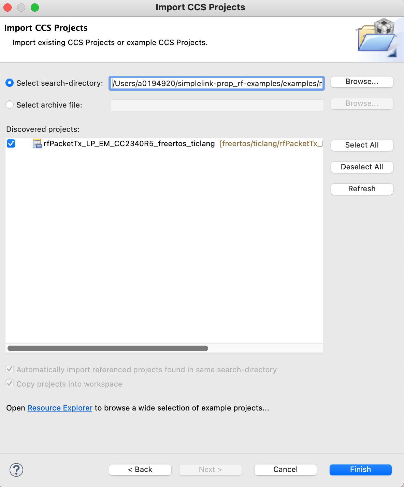

# simplelink-ble5stack-examples

This GitHub project contains the F2 and F3 ble5stack examples for Linux.  Builds based on the 7.10 F2 and F3 SDKs.  Please note, F2 repository name will change from simplelink-lowpower-f2-sdk to cc13xx_cc26xx_sdk so it will match with the name of the existing F2 SDK.

## Setup Instructions

### SDK Build
By default, the F2 and F3 SDKs are included as submodules.  Depending on which devices are of interest, only one family of SDK needs to be built.  See [SDK/Board/Device/Association](#SDK_Association) for details. 

### Edit **imports.mak**
In each family subdirectory, there is a imports.mak file that is a generic sample and will not work out of the box.  This file must be updated with the tool (compilers, cmake, etc.) paths installed on your system.

For a Linux build, settings must be updated to match your build system's setup.  The only outlier may be Python, as most python3.6+ interpreters will work.  Please note cmake must be 3.21+, or the builds will fail.  If using CCS ccs1220, the sysconfig installed is incompatible with the SDKs.  Either upgrade CCS to ccs1230 or install sysconfig 1.16.1 from https://www.ti.com/tool/SYSCONFIG.  See [Resources](#Resources) for URL's of tools that need installation to build the SDKs and examples.  Please note, XDC_INSTALL_DIR was required in older SDKs but no longer needed.

By default TICLANG and GCC toolchains are enabled.  If a toolchain is not needed, unset the compiler, for example, `GCC_ARMCOMPILER ?=`.

### Default imports.mak

#`XDC_INSTALL_DIR`        ?= /home/username/ti/xdctools_3_62_01_15_core (XDC not required for 7.10+ SDK's) 

`SYSCONFIG_TOOL`         ?= /home/username/ti/ccs1230/ccs/utils/sysconfig_1.16.1/sysconfig_cli.sh

`FREERTOS_INSTALL_DIR`   ?= /home/username/FreeRTOSv202104.00

`CMAKE`                 ?= /home/username/cmake-3.21.3/bin/cmake

`PYTHON`                 ?= python3

`TICLANG_ARMCOMPILER`    ?= /home/username/ti/ccs1230/ccs/tools/compiler/ti-cgt-armllvm_2.1.3.LTS-0

`GCC_ARMCOMPILER`        ?= /home/username/ti/ccs1230/ccs/tools/compiler/9.2019.q4.major-0

Edit **imports.mak** and update all of the above tool location variables to reflect the paths on your build system.

## Build SDK Libraries
SDK libraries must exist before building any examples. To build SDK libraries from the simplelink-ble5stack-examples:

$ cd simplelink-lowpower-f2-sdk/

$ make

or

$ cd simplelink-lowpower-f3-sdk/ (Change me for final)

$ make

The make will go through the SDK and build all libraries.  Depending on the build machine, the make will run for a few minutes.   Please note, in the production release, simplelink-lowpower-f2-sdk/ will be renamed cc13xx_cc26xx_sdk/.

## Build Examples From CCS

Before building from CCS, the SDKs must have been built (see Build SDK Libraries), and CCS must be configured with the locations of the SDK, FreeRTOS.  THe SDK's must be built before examples will compile (see Build SDK Libraries). 
 

Some of the CCS TI Clang projectspecs for the BLE examples specify a full path, relative to the SDK installation directory, to the linker command file.  For example, the persistent_app for CC1352P_2_LAUNCHXL (tirtos7/ticlang) example has the following linker option:

-l${COM_TI_SIMPLELINK_CC13XX_CC26XX_SDK_INSTALL_DIR}/examples/rtos/CC1352P_2_LAUNCHXL/ble5stack/persistent_app/tirtos7/ticlang/cc13x2_cc26x2_app_tirtos7.cmd

While this approach works for most SDK distributions, when the SDK is consumed as a Git submodule, the examples/ directory is not present in the SimpleLink SDK, so this path will lead to build (link) errors.  If the example import has this issue, there are a few ways to work around this issue until it is resolved:

* Before importing the example into CCS, modify the .projectspec and change the .cmd line from:
  
  "-l${COM_TI_SIMPLELINK_CC13XX_CC26XX_SDK_INSTALL_DIR}/examples/rtos/CC1352P_2_LAUNCHXL/ble5stack/persistent_app/tirtos7/ticlang/cc13x2_cc26x2_app_tirtos7.cmd" 
  
  to  
  
  "../../tirtos7/ticlang/cc13x2_cc26x2_app_tirtos7.cmd" 
  
  in the example's project spec file at 
  
  "\<**BLE5 Stack Examples**\>/examples/rtos/CC1352P_2_LAUNCHXL/ble5stack/persistent_app/tirtos7/ticlang/persistent_app_CC1352P_2_LAUNCHXL_tirtos7_ticlang.projectspec. 

* Linux/Mac users can create a symlink in their SDK, named 'examples' that links to the root of the BLE examples repo, like this:
  
  cd \<**BLE5 Stack Examples**\>simplelink-lowpower-f3-sdk (or F2 SDK)

  ln -s ../examples .

Add the location of simplelink-ble5stack-examples/simplelink-lowpower-f2-sdk and simplelink-ble5stack-examples/simplelink-lowpower-f3-sdk to CCS.

1. Preferences->Code Composer Studio->Products 
2. Select Add... 
3. Navigate to where simplelink-ble5stack-examples/simplelink-lowpower-f2-sdk and/or simplelink-ble5stack-examples/simplelink-lowpower-f3-sdk is installed
4. Select Open.  
 
The above steps will add the SDK to the build path.  Successful addition of the SDKs will be displayed under "Discovered Products:".  Note the highlighted section under "Discovered products:".  Plesae ensure the correct version of F2 and F3 SDK's are selected as CCS may discover other SDK versions.

The location of FreeRTOS must be configured in CCS.  This is done by Preferences->Code Composer Studio->Build->Environment.  Then select Add... Add the variable name `FREERTOS_INSTALL_DIR` and set it to the absolute path of FreeRTOS on the build system.

 After re-starting CCS, File->import->Code Composer Studio->CCS Projects and press next.  From simplelink-ble5stack-examples/ navigate to examples/rtos/<board_name/ble5stack/<example_name>/<rtos> or examples/nortos/<board_name/ble5stack/<example_name>/. As a concrete example, navigate to **examples/rtos/LP_CC1352P7_4/ble5stack/simple_peripheral**.

Press Browse, then Open.  Available examples will show up in the dialog box.  Select the example and press Finish.  After selecting Finish, the example chosen will import into your workspace.

## Resources

Tools Download Locations

SysConfig (SYSCONFIG_TOOL) https://www.ti.com/tool/SYSCONFIG, or if using ccs1230+ it is part of CCS

Free RTOS (FREERTOS_INSTALL_DIR) https://github.com/FreeRTOS/FreeRTOS/releases/download/202104.00/FreeRTOSv202104.00.zip

TI CLANG Compiler (TICLANG_ARMCOMPILER) https://www.ti.com/tool/CCSTUDIO 

ARM Gnu Toolchain (GCC_ARMCOMPILER) https://developer.arm.com/tools-and-software/open-source-software/developer-tools/gnu-toolchain/gnu-rm/downloads/9-2019-q4-major

## Troubleshooting

When building on *nix platform (Linux/Mac) the library build will fail with an error similar to:

error: /Applications/Xcode.app/Contents/Developer/Toolchains/XcodeDefault.xctoolchain/usr/bin/ranlib: Unsupported triple for mach-o cpu type: thumbv6m-ti-none-eabi

To fix, make sure the arm version of ranlib is in the path before the OS version of ranlib located in /usr/bin. Simply set the location of the gcc ARM ranlib ahead in the shell's path.  Example:

export `PATH`=/Users/username/ti/gcc_arm_none_eabi_9_2_1/arm-none-eabi/bin:$PATH

## SDK_Association

[F2](simplelink_cc13xx_cc26xx_sdk.md)

[F3](simplelink_lowpower_f3_sdk.md)
