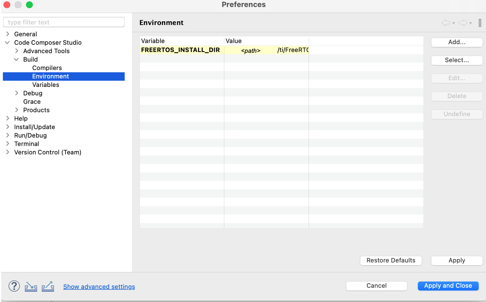

# SimpleLink Bluetooth Low Energy (LE) Stack Examples (simplelink-ble5stack-examples)

This repository contains the ble5stack examples for TI devices supported by the
SimpleLink Low Power F2 and F3 SDKs.  To learn which devices are supported by
each SDK, refer to the [SDK Device Association section](#sdk-association).

## Repository Layout

The **examples/** directory contains the same ble5stack examples provided in those
SDKs, in the same directory structure.

The SimpleLink Low Power F2 and F3 SDKs are provided as [Git
submodules](https://www.git-scm.com/docs/gitsubmodules) in their respective
subdirectories.  If you're only interested in devices supported by the F3 SDK,
you will only need to initialize and update the F3 SDK submodule.

As a quick reference, you can initialize and update a single Git submodule in
one step like this:

```bash
# To initialize and update the F2 SDK
.../simplelink-ble5stack-examples$ git submodule update --init cc13xx_cc26xx_sdk

# To initialize and update the F3 SDK
.../simplelink-ble5stack-examples$ git submodule update --init simplelink-lowpower-f3-sdk
```

Alternatively you can initialize/update _all_ submodules when cloning a repo
with `git clone --recurse-submodules {repo-ref}`.  See Git documentation for
details.

Once initialized and updated, you can refer to each SDK's README.md and Release
Notes for details on how to download its dependencies, and build its libraries.

* [SimpleLink Low Power F2 SDK
  README](https://github.com/TexasInstruments/cc13xx_cc26xx_sdk/blob/main/README.md)
* [SimpleLink Low Power F3 SDK
  README](https://github.com/TexasInstruments/simplelink-lowpower-f3-sdk/blob/main/README.md)

> Note, the links above are to online copies of the latest SDK READMEs.  They
> are useful for online readers, but be sure to consult the SDK submodule's
> _actual_ README.md after cloning, checking out your branch/tag, and updating
> your submodule, as details may change from release to release.

## Setup Instructions

### Build SDK Libraries

Each time you update an SDK submodule, you will need to build its libraries.
This process _can_ vary between the different SDKs, so refer to each SDK's
README.md for specifics, but generally you will need to edit the **imports.mak**
file at the top, then run `make`.

Note that _sometimes_ the dependencies can vary from SDK to SDK.  For example,
if you've been using the F2 SDK and SysConfig version X, and want to start using
the F3 SDK, it may require a newer SysConfig version.  So, again, be sure to
refer to each SDK's README.md and Release Notes.

Often newer versions of dependencies are compatible, so you can use
newer-and-compatible versions than the SDK was validated against.  But each SDK
does have its own **imports.mak** so you _can_ specify different dependency
versions for each SDK if needed.

## Build Examples

After building the SDK libraries, you can build the ble5stack examples.  The
examples support a few ways to build:

* [CCS IDE](#build-examples-from-ccs)
* [IAR IDE](#build-examples-from-iar)


### Build Examples From CCS

Remember, before building the examples, you must build the SDK libraries!

The examples also include TI Code Composer Studio (CCS) project support,
enabling them to be imported into, and built by, CCS.

Before importing the example, the SDK(s) location must be registered with CCS:

1. Preferences->Code Composer Studio->Products
2. Select Add...
3. Navigate to the SDK submodule location
4. Select Open

Repeat for each SDK you will be using.  This registers the SDK with CCS.
Successful registration of an SDK will show it in the "Discovered
Products" list:


If using FreeRTOS, its location must also be configured in CCS:

1. Preferences->Code Composer Studio->Build->Environment
2. Select Add...
3. Add the variable name `FREERTOS_INSTALL_DIR`
4. Assign it to the absolute path of your installation of FreeRTOS



Now you can import an example!

1. Project->Import CCS Project...
2. Select search-directory->Browse...
3. Navigate to a directory within your clone of the example repo to search for
   examples and Select Folder
4. Select the example(s) you wish to import and press Finish


### Build Examples from IAR

Remember, before building the examples, you must build the SDK libraries!

Follow the instructions in your respective SDK's Quick Start Guide:

* [SimpleLink Low Power F2 SDK Quick Start Guide](https://dev.ti.com/tirex/explore/node?node=A__AC7UNBWx3i6iMAUzzhqKwA__com.ti.SIMPLELINK_CC13XX_CC26XX_SDK__BSEc4rl__LATEST)
* [SimpleLink Low Power F3 SDK Quick Start Guide](https://dev.ti.com/tirex/explore/node?node=A__AC7UNBWx3i6iMAUzzhqKwA__com.ti.SIMPLELINK_LOWPOWER_F3_SDK__58mgN04__LATEST)

## Troubleshooting

When building on *nix platform (Linux/Mac) the library build may fail with an
error similar to:

```bash
error: /Applications/Xcode.app/Contents/Developer/Toolchains/XcodeDefault.xctoolchain/usr/bin/ranlib: Unsupported triple for mach-o cpu type: thumbv6m-ti-none-eabi
```

To fix, make sure the arm version of ranlib is in the path before the OS version
of ranlib located in /usr/bin. Simply set the location of the gcc ARM ranlib
ahead in the shell's path.  Example:

```bash
$ export PATH=/Users/username/ti/gcc_arm_none_eabi_9_2_1/arm-none-eabi/bin:$PATH
```

## SDK Association

Click the links below to find the devices supported by each SDK.

* [SimpleLink Low Power F2 SDK devices](images/simplelink_cc13xx_cc26xx_sdk.md)
* [SimpleLink Low Power F3 SDK devices](images/simplelink_lowpower_f3_sdk.md)
